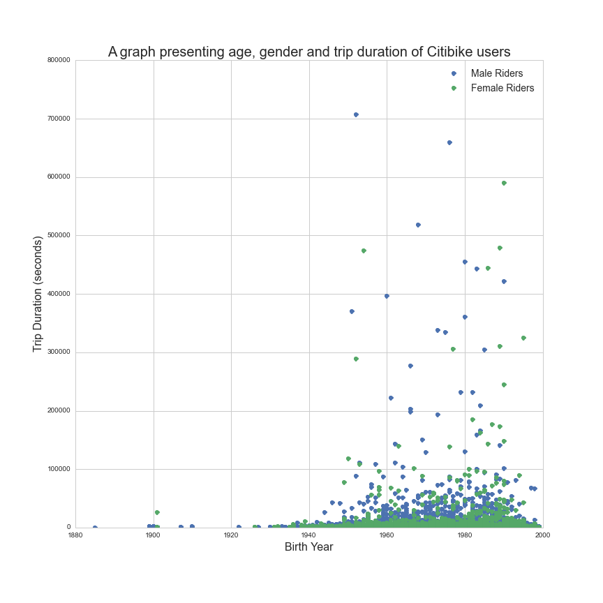

Plot:

Comment:

Assuming each point represents each Citibike ride, there are a couple of shortcomings that detracts from the intended representation. The first one is the use of seconds as trip duration that is not intuitive; by changing it into minutes the graph would be more easily understandable. The second one is the presence of (assumed) outliers, which by itself might convey information, renders the majority of the markers hard to observe. The choice of color to separate gender is a good idea, although the end result makes it hard to draw conclusions: how is the usage of male users differs from female users? binning the birth year into a group of ages (e.g. 18-20, 20-22) and present the average value may yield similar insight with much better readability. 
